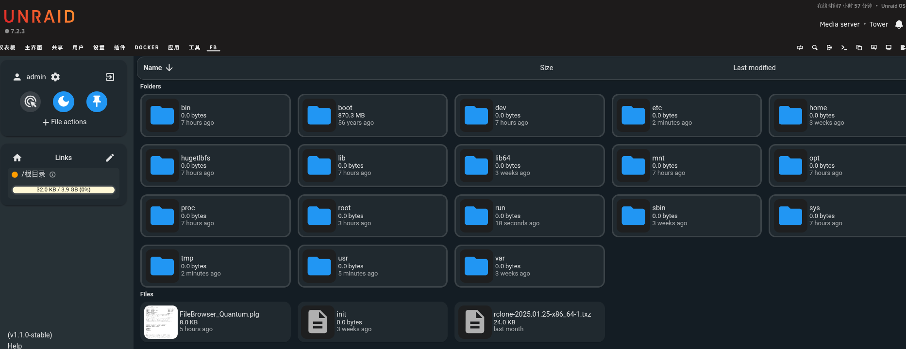

<div align="center">

  
  <h3>unRAID_Plugins_FBQ</h3>
  <br/>
  这是文件浏览器 FileBrowser Quantum 的 unRAID 插件移植版本
  <br/>
</div>
<br/>

<br />

# 使用 Use
打开 unRAID WebUI，进入“插件”标签页，点击“安装插件”，在输入框中输入以下URL并安装：

```bash
https://raw.githubusercontent.com/InSnocent/Unraid_Plugins_FBQuantum/refs/heads/master/FB.plg

```
安装完成后，在“设置”标签页 -> “用户实用程序”中找到 “FileBrowser Q” 进行配置。

***


Open unRAID WebUI, go to the "Plugins" tab, click "Install Plugin", and enter the following URL in the input box:
```bash
https://raw.githubusercontent.com/InSnocent/Unraid_Plugins_FBQuantum/refs/heads/master/FB.plg
```

After installation, go to the "Settings" tab -> "User Utilities" to find "FileBrowser Q" for configuration.


# 说明 Description
+ 默认账号：admin<br/>
+ 默认密码：admin<br/>
+ 更多内容请查看[FileBrowser Quantum 官方文档](https://filebrowserquantum.com/en/docs/)<br/>

+ Default account: admin<br/>
+ Default password: admin<br/>
+ For more information, please refer to the [FileBrowser Quantum official documentation](https://filebrowserquantum.com/en/docs/)<br/>

# 关于 About
insomnia417跨年的时候又在折腾NAS，然后就有了这个项目（笑）


# 感谢 Thanks
原项目：[FileBrowser Quantum](https://github.com/gtsteffaniak/filebrowser)<br />
参考文章：[Luu.Moe](https://luu.moe/115)<br/>
参考项目：[Unraid-snmp](https://github.com/kubedzero/unraid-snmp)
