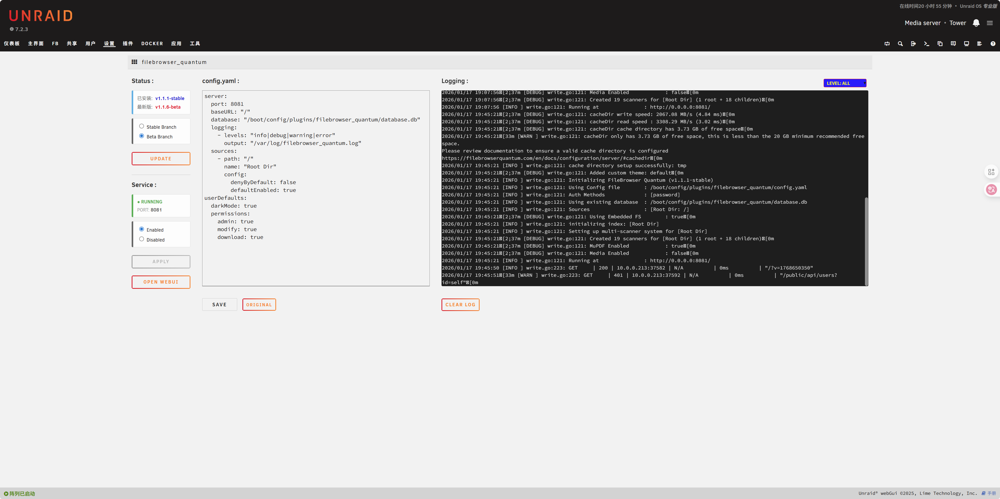

# FileBrowser Quantum for Unraid

<p align="center">
  
</p>

<p align="center">
  <a href="README_CN.md">中文</a> | English
</p>

<p align="center">
  
  
</p>

---

## Introduction

**FileBrowser Quantum** is a high-performance file manager plugin designed specifically for Unraid. Based on the FileBrowser core, it features a refactored decoupled architecture to provide a modern and smooth file management experience.

---
### Installation
1. Open Unraid console, click the **Apps** tab.
2. Search for `FileBrowser Quantum` and click **Install**.
3. *Alternatively*, install manually via URL in **Plugins** -> **Install Plugin**:
```
https://raw.githubusercontent.com/insomnia417/Unraid-FileBrowser_Quantum-Plugins/main/FileBrowser_Quantum.plg
```

Open unRAID WebUI, go to the "Plugins" tab, click "Install Plugin", and enter the following URL in the input box:


---

## Configuration

After installation, go to **Settings -> Utilities -> FileBrowser Quantum** to configure the plugin.

###
+ Default account: admin<br/>

+ Default password: admin<br/>

+ For more information, please refer to the [FileBrowser Quantum official documentation](https://filebrowserquantum.com/en/docs/)<br/>
